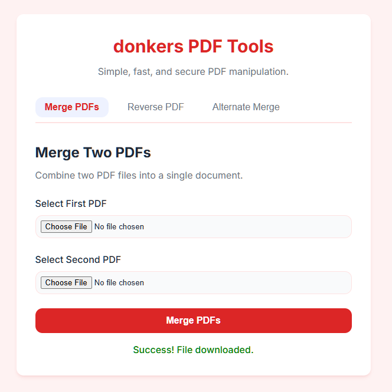

# Donkers PDF Tools

A simple, secure, and fast web-based interface for manipulating PDF files.

## Features

- **Merge PDFs**: Combine two PDF files into a single document.
- **Reverse PDF**: Reverse the page order of a PDF file.
- **Alternate Merge**: Interleave pages from two PDFs (e.g., Page 1 from A, Page 1 from B, Page 2 from A...).



## Prerequisites

- [Node.js](https://nodejs.org/) (v12 or higher recommended)

## Installation

1.  Clone or download this repository.
2.  Open a terminal in the project directory.
3.  Install the dependencies:

    ```bash
    npm install
    ```

## Usage

1.  Start the server:

    ```bash
    node server.js
    ```

2.  Open your web browser and navigate to:

    [http://localhost:3000](http://localhost:3000)

3.  Select the tool you want to use from the tabs, upload your files, and click the action button to download the processed PDF.

## CLI Usage

You can still use the underlying script via the command line if you prefer:

```bash
# Merge
# Combine two PDF files into a single document.
node donkersPdfTools.js merge input1.pdf input2.pdf output.pdf

# Reverse
# Reverse the order of pages in a PDF file.
node donkersPdfTools.js reverse input.pdf output.pdf

# Alternate Merge
# Merge two PDFs by interleaving their pages (e.g., Page 1 from A, Page 1 from B, Page 2 from A...)
node donkersPdfTools.js altMerge input1.pdf input2.pdf output.pdf
```

## Testing

To run the automated test suite, ensure you have installed the dev dependencies:

```bash
npm install
```

Then, run the tests using:

```bash
npm test
```
